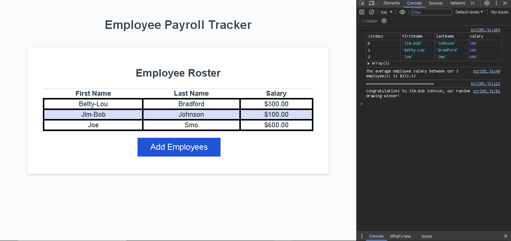

# Employee Tracker App

## Description

This helpful app will enable businesses to keep track of employee salaries in order to make smarter budgeting decisions.

## Installation

No installation is necessary. 
Visit [Flem House Tech](https://jfleming963.github.io/JFleming963-Portfolio/) to load the app into the browser window.

## Usage

Click the "Add Employees" button, and the user will be prompted to enter the employees first name, last name, and salary. If the user enters invalid data, they will be alerted to reenter the information. Upon entering the requested information, a table will be rendered in the browser containing the data.

In the console, there will be logged another table with the same data. the average employee salary. Also, a random employee will be selected to win a drawing. The drawing winner will be displayed in the console. 

## Credits

## License 

Please refer to the LICENSE in the repo.

